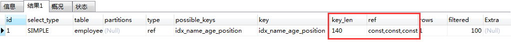
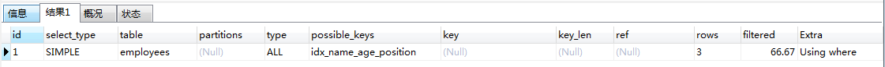

> **使用EXPLAIN关键字可以模拟优化器执行SQL语句，从而知道MySQL是 如何处理你的SQL语句的。分析你的查询语句或是结构的性能瓶颈** 

#### 创建表

```
DROP TABLE IF EXISTS `actor`;
CREATE TABLE `actor` (
  `id` int(11) NOT NULL,
  `name` varchar(45) DEFAULT NULL,
  `update_time` datetime DEFAULT NULL,
  PRIMARY KEY (`id`)
) ENGINE=InnoDB DEFAULT CHARSET=utf8;

INSERT INTO `actor` (`id`, `name`, `update_time`) VALUES (1,'a','2017-12-22 15:27:18'), (2,'b','2017-12-22 15:27:18'), (3,'c','2017-12-22 15:27:18');

DROP TABLE IF EXISTS `film`;
CREATE TABLE `film` (
  `id` int(11) NOT NULL AUTO_INCREMENT,
  `name` varchar(10) DEFAULT NULL,
  PRIMARY KEY (`id`),
  KEY `idx_name` (`name`)
) ENGINE=InnoDB DEFAULT CHARSET=utf8;

INSERT INTO `film` (`id`, `name`) VALUES (3,'film0'),(1,'film1'),(2,'film2');

DROP TABLE IF EXISTS `film_actor`;
CREATE TABLE `film_actor` (
  `id` int(11) NOT NULL,
  `film_id` int(11) NOT NULL,
  `actor_id` int(11) NOT NULL,
  `remark` varchar(255) DEFAULT NULL,
  PRIMARY KEY (`id`),
  KEY `idx_film_actor_id` (`film_id`,`actor_id`)
) ENGINE=InnoDB DEFAULT CHARSET=utf8;
INSERT INTO `film_actor` (`id`, `film_id`, `actor_id`) VALUES (1,1,1),(2,1,2),(3,2,1); 

```

#### explain 

```
explain extended select * from film ;
show warnings; 
```

- **explain extended** select * from film ; 会在 explain 的基础上额外提供一些查询优化的信息
  show warnings;  通过 show warnings 命令可以 得到优化后的查询语句，从而看出优化器优化了什么
- **explain partitions** 相比 explain 多了个 partitions 字段，如果查询是基于分区表的话，会显示查询将访问的分区。

#### explain 中的列

- id

  id列的编号是 select 的序列号，有几个 select 就有几个id，并且id的顺序是按 select 出现的顺序增长的。MySQL将 select 查询分为简单查询(SIMPLE)和复杂查询(PRIMARY)。

  复杂查询分为三类：简单子查询、派生表（from语句中的子查询）、union 查询。

  id列越大执行优先级越高，id相同则从上往下执行，id为NULL最后执行

  ```
  explain select (select 1 from actor limit 1) from film;
  ```

  

  

- **select_type**列

  - **simple**：简单查询。查询不包含子查询和union
  - **primary**：复杂查询中最外层的 select
  - **subquery**：包含在 select 中的子查询（不在 from 子句中）
  - **derived**：包含在 from 子句中的子查询。MySQL会将结果存放在一个临时表中，也称为派生表（derived的英文含义）
  - **union**：在 union 中的第二个和随后的 select
  - **union result**：从 union 临时表检索结果的 select

- **table**列

  这一列表示 explain 的一行正在访问哪个表


- **type**列

  这一列表示关联类型或访问类型，即MySQL决定如何查找表中的行，查找数据行记录的大概范围。

  **依次从最优到最差分别为：system > const > eq_ref > ref > range > index > ALL**

  一般来说，得保证查询达到range级别，最好达到ref

  

  - **NULL**：mysql能够在优化阶段分解查询语句，在执行阶段用不着再访问表或索引。例如：在索引列中选取最小值，可以单独查找索引来完成，不需要在执行时访问表

    ```
     explain select min(id) from film; 
    ```

    

  - **const, system**：mysql能对查询的某部分进行优化并将其转化成一个常量（可以看show warnings 的结果）。用于 primary key 或 unique key 的所有列与常数比较时，所以**表最多有一个匹配行**，读取1次，速度比较快。**system**是const**的特例，表里只有一条元组匹配时为**system

    ```
    mysql> explain extended select * from (select * from film where id = 1) tmp;
    ```

    

  - **eq_ref**

    ```
    mysql>explain select * from film_actor left join film on film_actor.film_id = film.id;
    ```

    

  - **ref**

    相比 eq_ref，不使用唯一索引，而是使用普通索引或者唯一性索引的部分前缀，索引要和某个值相比较，可能会找到多个符合条件的行。

    > 简单 select 查询，name是普通索引（非唯一索引）

    ```
    explain select * from film where name = "film1"; 
    ```

    

  

  - **range**

    范围扫描通常出现在 **in(), between ,> ,<, >=** 等操作中。使用一个索引来检索给定范围的行

    ```
     explain select * from actor where id > 1;
    ```

    

  - **index**：全索引扫描，比ALL快。（index是从索引中读取的，而all是从硬盘中读取）

    ```
    explain select * from film; 
    ```

    

  - **ALL**：即全表扫描，意味着mysql需要从头到尾去查找所需要的行。通常情况下这需要增加索引来进行优化了

    ```
    explain select * from actor; 
    ```

    

- **possible_keys列**

  > 这一列显示查询可能使用哪些索引来查找。 
  >
  > explain 时可能出现 possible_keys 有列，而 key 显示 NULL 的情况，这种情况是因为表中数据不多，mysql认为索引对此查询帮助不大，选择了全表查询。 
  >
  > 如果该列是NULL，则没有相关的索引。在这种情况下，可以通过检查 where 子句看是否可以创造一个适当的索引来提高查询性能，然后用 explain 查看效果。

- **key列**

  > 这一列显示mysql实际采用哪个索引来优化对该表的访问。
  >
  > 如果没有使用索引，则该列是 NULL。如果想强制mysql使用或忽视possible_keys列中的索引，在查询中使用 force index、ignore index。

- **key_len列**

  这一列显示了mysql在索引里使用的字节数，通过这个值可以算出具体使用了索引中的哪些列。 

  举例来说，film_actor的联合索引 idx_film_actor_id 由 film_id 和 actor_id 两个int列组成，并且每个int是4字节。通过结果中的key_len=4可推断出查询使用了第一个列：film_id列来执行索引查找。

  ```
  explain select * from film_actor where film_id = 2;
  ```

  

  **key_len计算规则如下：**

  - 字符串
    - n char(n)：n字节长度
    - n varchar(n)：2字节存储字符串长度，如果是utf-8，则长度 3n + 2
  - l 数值类型
    - tinyint：1字节
    - smallint：2字节
    - int：4字节
    - bigint：8字节
  - l 时间类型　
    - date：3字节
    - timestamp：4字节
    - datetime：8字节
  - l 如果字段允许为 NULL，需要1字节记录是否为 NULL
  - 索引最大长度是768字节，当字符串过长时，mysql会做一个类似左前缀索引的处理，将前半部分的字符提取出来做索引。

- **ref列**

  > 这一列显示了在key列记录的索引中，表查找值所用到的列或常量，常见的有：const（常量），字段名（例：film.id）

- **rows**列

  > 这一列是mysql估计要读取并检测的行数，注意这个不是结果集里的行数。

- **Extra**列

  这一列展示的是额外信息。常见的重要值如下： 

  - **Using index**：查询的列被索引覆盖，并且where筛选条件是索引的前导列，是性能高的表现。一般是使用了**覆盖索引**(索引包含了所有查询的字段)。对于innodb来说，如果是辅助索引性能会有不少提高

  ```
  mysql> explain select film_id from film_actor where film_id = 1;
  ```

  

  - **Using where**：查询的列未被索引覆盖，where筛选条件非索引的前导列

    ```
    explain select * from actor where name = 'a';
    ```

  

  - **NULL**：查询的列未被索引覆盖，并且where筛选条件是索引的前导列，意味着用到了索引，但是部分字段未被索引覆盖，必须通过“回表”来实现，不是纯粹地用到了索引，也不是完全没用到索引

    ```
    explain select * from film_actor where film_id = 1;
    ```

    

  - **Using index condition**：与Using where类似，查询的列不完全被索引覆盖，where条件中是一个前导列的范围；

    ```
    explain select * from film_actor where film_id > 1;
    ```

    

  - **Using temporary**：mysql需要创建一张临时表来处理查询。出现这种情况一般是要进行优化的，首先是想到用索引来优化。

    actor.name没有索引，此时创建了张临时表来distinct 

    ```
    explain select distinct name from actor; 
    ```

    

    film.name建立了idx_name索引，此时查询时extra是using index,没有用临时表 

    ```
    explain select distinct name from film; 
    ```

    

  - **Using filesort**：mysql 会对结果使用一个外部索引排序，而不是按索引次序从表里读取行。此时mysql会根据联接类型浏览所有符合条件的记录，并保存排序关键字和行指针，然后排序关键字并按顺序检索行信息。这种情况下一般也是要考虑使用索引来优化的。

    - actor.name未创建索引，会浏览actor整个表，保存排序关键字name和对应的id，然后排序name并检索行记录

      ```
      explain select * from actor order by name; 
      ```

      

    - film.name建立了idx_name索引,此时查询时extra是using index

      ```
      explain select * from film order by name; 
      ```

      

#### 最佳实践

- 使用的表 

  ```
  CREATE TABLE `employees` (
    `id` int(11) NOT NULL AUTO_INCREMENT,
    `name` varchar(24) NOT NULL DEFAULT '' COMMENT '姓名',
    `age` int(11) NOT NULL DEFAULT '0' COMMENT '年龄',
    `position` varchar(20) NOT NULL DEFAULT '' COMMENT '职位',
    `hire_time` timestamp NOT NULL DEFAULT CURRENT_TIMESTAMP COMMENT '入职时间',
    PRIMARY KEY (`id`),
    KEY `idx_name_age_position` (`name`,`age`,`position`) USING BTREE
  ) ENGINE=InnoDB AUTO_INCREMENT=4 DEFAULT CHARSET=utf8 COMMENT='员工记录表';
  
  INSERT INTO employees(name,age,position,hire_time) VALUES('LiLei',22,'manager',NOW());
  INSERT INTO employees(name,age,position,hire_time) VALUES('HanMeimei', 23,'dev',NOW());
  INSERT INTO employees(name,age,position,hire_time) VALUES('Lucy',23,'dev',NOW());
  
  ```

  

- 全值匹配

  ```
  EXPLAIN SELECT * FROM employees WHERE name= 'LiLei';
  ```

  

  ```
  EXPLAIN SELECT * FROM employees WHERE name= 'LiLei' AND age = 22;
  ```

  

  ```
  EXPLAIN SELECT * FROM employees WHERE name= 'LiLei' AND age = 22 AND position ='manager';
  ```

  

- 最左前缀法则

   如果索引了多列，要遵守最左前缀法则。指的是查询从索引的最左前列开始并且不跳过索引中的列。

  ```
  EXPLAIN SELECT * FROM employees WHERE age = 22 AND position ='manager';
  
  EXPLAIN SELECT * FROM employees WHERE position = 'manager';
  
  EXPLAIN SELECT * FROM employees WHERE name = 'LiLei';
  ```

- 不在索引列上做任何操作（计算、函数、（自动or手动）类型转换），会导致索引失效而转向全表扫描

  ```
  EXPLAIN SELECT * FROM employees WHERE name = 'LiLei';
  
  EXPLAIN SELECT * FROM employees WHERE left(name,3) = 'LiLei';
  ```

  

- 存储引擎不能使用索引中范围条件右边的列

  ```
  EXPLAIN SELECT * FROM employees WHERE name= 'LiLei' AND age = 22 AND position ='manager';
  
  EXPLAIN SELECT * FROM employees WHERE name= 'LiLei' AND age > 22 AND position ='manager';
  ```

  

  

- 尽量使用覆盖索引（只访问索引的查询（索引列包含查询列）），减少select \*语句

  ```
  EXPLAIN SELECT name,age FROM employees WHERE name= 'LiLei' AND age = 23 AND position ='manager';
  ```

  

  ```
  EXPLAIN SELECT * FROM employees WHERE name= 'LiLei' AND age = 23 AND position ='manager';
  ```

  

- mysql在使用不等于（！=或者<>）的时候无法使用索引会导致全表扫描

  ```
  EXPLAIN SELECT * FROM employees WHERE name != 'LiLei'
  ```

  

- is null,is not null 分2种情况:

  - name为not null时，is null索引失效，is not null 索引失效

  ```
  EXPLAIN SELECT * FROM employees WHERE name is null
  ```

  

  - name为null时 is not null 索引失效，is null索引生效

  ```
  EXPLAIN SELECT * FROM employees WHERE name is  null
  ```

  

- like以通配符开头（'$abc...'）mysql索引失效会变成全表扫描操作

  ```
  EXPLAIN SELECT * FROM employees WHERE name like '%Lei'
  ```

  

  ```
  EXPLAIN SELECT * FROM employees WHERE name like 'Lei%'
  ```

  

  - 问题：解决like'%字符串%'索引不被使用的方法？

    - 使用覆盖索引，查询字段必须是建立覆盖索引字段

      ```
      EXPLAIN SELECT name,age,position FROM employees WHERE name like '%Lei%';
      ```

      

    - 当覆盖索引指向的字段是varchar(380)及380以上的字段时，覆盖索引会失效！
    - **like KK%相当于=常量，%KK和%KK% 相当于范围**

- 字符串不加单引号索引失效

  ```
  EXPLAIN SELECT * FROM employees WHERE name = '1000';
  EXPLAIN SELECT * FROM employees WHERE name = 1000;
  ```

  

- 少用or,用它连接时很多情况下索引会失效

  ```
  EXPLAIN SELECT * FROM employees WHERE name = 'LiLei' or name = 'HanMeimei';
  ```

  

#### order by /group by

**创建test表（测试表）**

```
drop table if exists test; create table test( id int primary key auto_increment, c1 varchar(10), c2 varchar(10), c3 varchar(10), c4 varchar(10), c5 varchar(10) ) ENGINE=INNODB default CHARSET=utf8;insert into test(c1,c2,c3,c4,c5) values('a1','a2','a3','a4','a5');insert into test(c1,c2,c3,c4,c5) values('b1','b2','b3','b4','b5');insert into test(c1,c2,c3,c4,c5) values('c1','c2','c3','c4','c5');insert into test(c1,c2,c3,c4,c5) values('d1','d2','d3','d4','d5');insert into test(c1,c2,c3,c4,c5) values('e1','e2','e3','e4','e5');
```

**创建索引**

```
create index idx_test_c1234 on test(c1,c2,c3,c4);
```

```
show index from test;
```


**分析以下案例索引使用情况**

- case1:

  ```
  explain select * from test where c1='a1' and c2='a2' and c3='a3' and c4='a4';
  explain select * from test where c3='a3' and c2='a2' and c1='a1' and c4='a4';
  ```

  

  **分析：**

  - 索引的顺序是 c1,c2,c3,c4
  - 上面2个sql语句执行结果都一样：type=ref ,key_len=132

  **结论**

  在执行常量查询时，改变索引列的顺序并不会更改explain的执行结果，mysql底层优化器会进行优化。

- case2:

  ```
  explain select * from test where c1='a1' and c2='a2'
  ```

  

  ```
  explain select * from test where c1='a1' and c2='a2' and c3>'a3' and c4='a4';
  ```

  

  **分析**：

  当出现范围查询时，type=range，key_len=99,和不使用范围一样,比key_len=66增加了，说明使用了索引，但对吧case1，c4的索引失效了。

  **结论**

  范围右边列索引失效，但范围当前列是有效的（c3索引有效）从key_len=99 可以证明。

- case2.1：

  ```
  explain select * from test where c1='a1' and c2='a2' and c4>'a4' and c3='a3' ;
  ```

  

  **分析**：

  与上面case2对比，key_len=132 说明索引用到了4个，因为mysql底层做了优化，范围右边的索引列失效（但是c4列后面没有索引了），注意索引的顺序是**c1,c2,c3,c4**，所以number右边不会出现失效的索引，因此4个索引全部用上。

- case2.2:

  ```
  explain select * from test where c1>'a1' and c2='a2' and c3='a3' and c4='a4';
  ```

  

  **分析**

  如果在C1处使用了范围，则type=ALL，key=null,索引失效，全部扫描。这里违背了最佳左前缀法则，带头大哥已死，解决方式使用覆盖索引

  **结论**

  索引第一列（最左前列-带头大哥）索引失效，后面的索引全部失效。

- case3：

  ```
  explain select * from test where c1='a1' and c2='a2' and c4='a4' order by c3;
  ```

  

  **分析**

  利用最佳左前缀法则：中间兄弟不能断，因此用到了c1,c2索引查找。从key_len=66,ref=const,const,c3索引用在排序中。

- case3.1:

  ```
  explain select * from test where c1='a1' and c2='a2' order by c3;
  ```

  

- case3.2:

  ```
  explain select * from test where c1='a1' and c2='a2' order by c4;
  ```

  

  从explain执行结果来看，c1，c2使用了索引，由于用了c4进行排序，跳过了c3，出现了**Using filesort**

- case4:

  ```
  explain select * from test where c1='a1' and c5='a5' order by c2,c3;
  ```

  

  查找只用到了索引c1。排序用到了c2，c3.无**Using filesort**

- case4.1：

  ```
  explain select * from test where c1='a1' and c5='a5' order by c3,c2;
  ```

  

  因为索引顺序是**c1,c2,c3,c4**,但排序的时候c2,c3位置颠倒了。出现了**Using filesort**

- case5：

  ```
  explain select * from test where c1='a1' and c4='a4' group by c2,c3;
  ```

  

- case5.1:

  ```
  explain select * from test where c1='a1' and c4='a4' group by c3,c2;
  ```

  

  对比case5，在group by 颠倒了c2，c3的位置，结果出现了**Using filesort**   **Using temporary**   极度恶劣。原因：与索引创建顺序相反

- case6:

  ```
  explain select c1 from test order by c1 asc,c2 desc
  ```

  

  虽然排序字段与索引顺序一样，这里c2使用了desc变成了降序，导致与索引排序方式不同出现**Using filesort**

- case7：

  ```
  explain select c1 from test where c1 in('a1','b1') order by c2,c3;
  ```

  

  对于排序来说，多个相等条件也是范围查找。